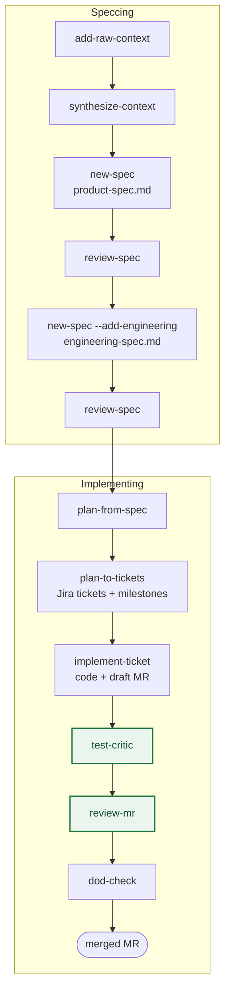
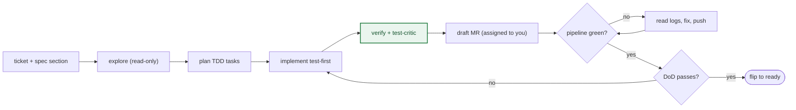
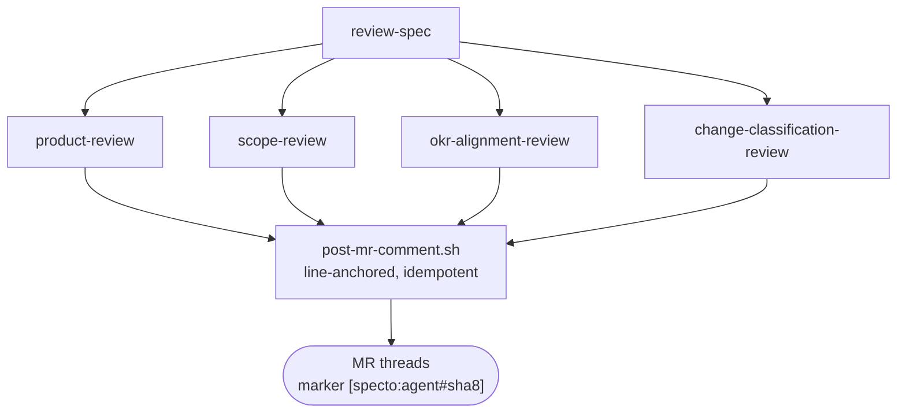
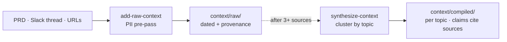
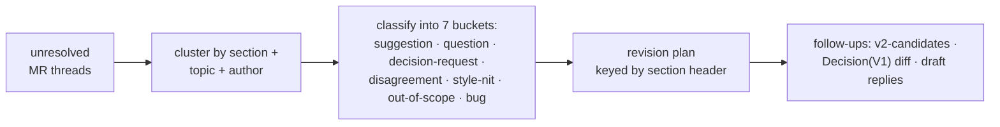
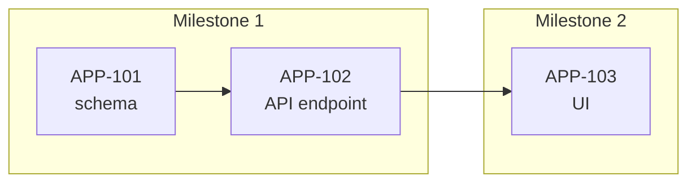
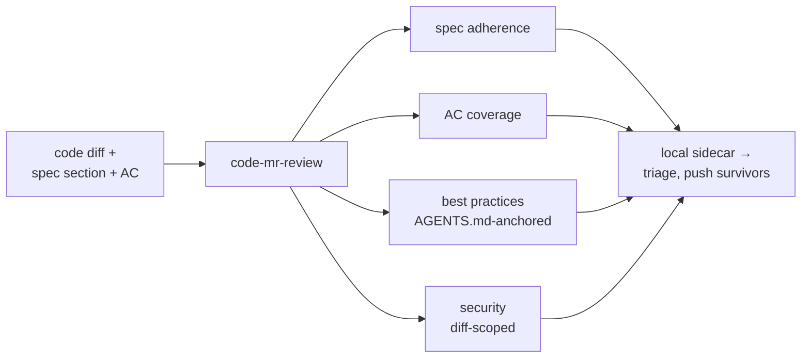
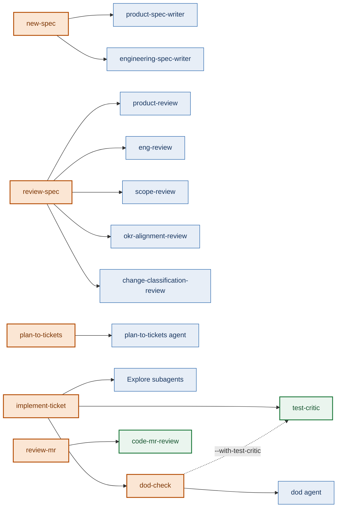

# Specto walkthrough

A practical guide to using Specto end-to-end: install, configure, draft a spec, review, plan, and ship — from an idea to a merged, reviewed MR.

**Two ways to read this:** new to Specto? Go top-to-bottom — it's a guided path. Coming back to look something up? Jump to the [Reference](#reference) at the foot.

> **New here? Start with this.** Specto's biggest payoff is turning a ticket into a review-ready MR. If you do nothing else: open any ticket that has acceptance criteria and say *"implement APP-1234"*. Specto explores the code, plans, writes it test-first, and opens a draft MR assigned to you. The full spec → plan → ticket pipeline below is how you *feed* that step at scale — but you can adopt it from either end.

---

## What is Specto?

Specto is a Claude Code plugin that operationalises a spec-to-implementation workflow where the repository is the single source of truth. It treats the repository as the single source of truth for planning context and orchestrates writing, reviewing, planning, ticketing, and implementing through a fixed sequence of skills.

You drive Specto by talking to Claude Code in plain language. Skills activate from natural-language triggers ("let's spec out X", "review this spec", "implement APP-1234"); under the hood they dispatch worker subagents and shell helpers. Every side effect on your tracker (Jira, Linear, GitHub Issues) or forge (GitLab, GitHub) goes through a small set of vetted helper scripts, never an ad-hoc CLI call.

> **Backends.** This walkthrough uses GitLab (forge) and Jira (tracker) as its worked example. Everything applies equally to GitHub, Linear, and GitHub Issues: skills call backend-neutral dispatchers under `scripts/forge/` and `scripts/tracker/`, which route to whichever backend your repo is configured for.

## Mental model

Three ideas explain almost everything Specto does:

- **The repo is the source of truth.** Specs live in `docs/development/specs/`, context lives next to them, and approval happens through ordinary merge requests. Nothing important hides in a chat log.
- **Skills orchestrate; subagents do the work.** A skill is the conductor — it gathers inputs, then fans out read-only or write-scoped subagents (writers, reviewers, a planner, a DoD checker, a test critic). That is why reviews and exploration can run many lanes in parallel.
- **Quality gates sit before the human.** Reviewing is the bottleneck, so Specto puts automated checks (`test-critic`, `review-mr`, `dod-check`) *between* the code being written and a human looking at it — so what you hand over is close to mergeable.

You can enter the workflow at any point. Have a vague idea? Start at `new-spec`. Have an approved spec? Jump to `plan-to-tickets`. Have a ticket from any source — even one that never touched Specto? Go straight to `implement-ticket` (it only needs acceptance criteria).

---

## Setup

### Prerequisites

| Tool | Why | Install |
|---|---|---|
| Claude Code | Runs the plugin | https://claude.com/claude-code |
| `superpowers` plugin | **Required** — install *before* Specto. Specto delegates to its skills (`brainstorming`, `writing-plans`, `test-driven-development`, `subagent-driven-development`, `verification-before-completion`, `dispatching-parallel-agents`) | `/plugin marketplace add obra/superpowers-marketplace` then `/plugin install superpowers@superpowers-marketplace` |
| `git` (or `jj`) | Version control; git is the default, `jj` is auto-detected | https://git-scm.com (almost certainly already installed) |
| Forge CLI: `glab` or `gh` | MR/PR reads/writes from reviewer agents, `review-mr`, `resolve-mr-comments`, `mr-walkthrough`. Pick the one matching your remote (auto-detected) | https://gitlab.com/gitlab-org/cli / https://cli.github.com |
| Tracker: `acli`, `LINEAR_API_KEY`, or `gh` | Jira via the Atlassian CLI; Linear via a personal API key (GraphQL, no CLI needed); GitHub Issues rides the `gh` install | https://developer.atlassian.com/cloud/acli/ / https://linear.app/settings/api |
| `jq` | JSON parsing in helper scripts and hooks | `brew install jq` |
| `mermaid-cli` | Optional — full syntax validation of generated diagrams (`validate-mermaid.sh`). The blocking palette/scaffold lints are pure bash. | `npm i -g @mermaid-js/mermaid-cli` |

### Install the plugin

```text
claude plugin marketplace add techwolf-ai/ai-first-toolkit
claude plugin install specto@techwolf-ai-first
```

Then run `/specto:setup` in your repo: it doctor-checks dependencies, detects your VCS and forge, probes CLI auth, writes the repo config, and runs an offline smoke test. Verify the skill list shows all 22: `setup`, `using-specto`, `new-spec`, `review-spec`, `add-raw-context`, `synthesize-context`, `plan-from-spec`, `plan-to-tickets`, `implement-ticket`, `implement-milestone`, `verify-milestone`, `run-epic`, `review-mr`, `mr-walkthrough`, `dod-check`, `reconcile-spec`, `resolve-spec-comments`, `resolve-mr-comments`, `plugin-feedback`, `create-mr`, `create-ticket`, `create-test-plan`.

### Per-repo configuration

Create `.specto/config.yml` at your repo root:

```yaml
notion_okr_page_id: <Notion page id>     # used by okr-alignment-review + load-okrs hook
jira_project_key: ABC                     # used by plan-to-tickets, implement-ticket (Jira)
# project: ENG                            # Linear team key (Linear tracker)
# forge: github                           # optional overrides; autodetect covers the common case
# tracker: jira                           # jira | github | linear
default_dod_checklist:                    # per-team fallback merged with the Jira-epic checklist
  - tests pass in CI
  - SLA page updated
  - feature flag wrapped
reviewers:                                # optional — default MR reviewers for implement-ticket
  - some.user
compliance:                               # optional — enables change-classification review +
  ...                                     # compliance-rigor DoD checks; copy the block from
                                          # references/compliance-profile.example.yml and adapt it
```

`new-spec` scaffolds a `.specto/.gitignore` for you that ignores everything except the inputs worth tracking:

```gitignore
# .specto/.gitignore
*
!.gitignore
!config.yml
!okrs.md
```

This keeps `config.yml` (your `notion_okr_page_id`) and `okrs.md` (the OKR snapshot) tracked so teammates and CI can run `okr-alignment-review`. `.specto/plan.md` (the transient implementation plan) stays ignored by the leading `*` — regenerate it from the spec each time. (Equivalently, you can ignore `.specto/` from your repo-root `.gitignore` with explicit `!.specto/<file>` exceptions.) Deferred V2 scope is *not* here — `resolve-spec-comments` writes `v2-candidates.md` into the spec folder, which is tracked docs.

### Authenticate the integrations

Per backend — `/specto:setup` probes these and prints the exact command when one is missing:

```bash
glab auth login                    # forge: GitLab
gh auth login                      # forge: GitHub (also covers GitHub Issues as tracker)
acli jira auth login               # tracker: Jira
export LINEAR_API_KEY=lin_api_...  # tracker: Linear (or an op:// 1Password reference)
```

Jira tenants with custom fields (impact/priority options, sprint field, epic checklist) declare them once in `.specto/tracker-jira.yml` — see `scripts/tracker/README.md`.

---

## The lifecycle at a glance

Specto is a fixed sequence with quality gates near the end. The green nodes are the automated quality gates.



Stakeholder feedback during the spec rounds is handled by `resolve-spec-comments`; reviewer feedback on the code MR by `resolve-mr-comments`. Three ambient hooks make the workflow context-aware: `SessionStart` surfaces spec paths, `UserPromptSubmit` appends OKRs while you edit specs, `PostToolUse` nudges toward `review-spec` after spec edits.

### Inside `implement-ticket`

The implement step is itself a loop. It runs in an isolated worktree, opens the MR as a **draft**, fixes its own pipeline (bounded to ~3 tries), and only flips to ready once CI is green *and* DoD passes. (A trivial one-file change skips explore + plan and goes straight to test-first.)



### Reusable pattern: parallel reviewer fan-out

`review-spec` (and its code-MR sibling `review-mr`) runs its reviewers as a **parallel fan-out**: it uses `superpowers:dispatching-parallel-agents` to dispatch N reviewer agents concurrently against the same MR, each reviewing one lane.



In engineering-spec mode the roster swaps to `eng-review` + `scope-review` + `change-classification-review`. `review-mr` swaps in the code-focused `code-mr-review` agent.

- **Collect mode by default:** each agent reviews one lane and returns findings; the skill presents them inline for you to triage (answer questions, dismiss false positives), and only the survivors you approve are posted — triage stays private until you choose to surface it. `--post` skips the inline pass and auto-posts (the non-interactive path for CI).
- **Single I/O path:** all MR reads go through `scripts/forge/mr-fetch.sh` (`--paginate`d); all posts through `scripts/forge/post-mr-comment.sh` (SHA resolution + idempotent search-then-edit) — agents never touch `glab api` directly.
- **Idempotent re-runs:** the `#<sha8>` marker (`sha1("<agent>\0<spec-path>\0<normalized-section>\0<normalized-finding-type>")`) is the dedup key — derived from a normalized `(section, finding-type)` pair, not free-text, so the review surface converges instead of accreting.

---

## Walkthrough: ship a feature end-to-end

This is the **full pipeline** — speccing a new initiative from scratch and carrying it to a merged MR. *(Just want the quick win? Run `implement-ticket` on an existing ticket — the quickstart up top — and skip the rest; you can adopt the pipeline later.)* It follows a fictional "task feedback loop" feature; the commands are copy-paste-able.

### Step 1. Gather raw context

Pull your source material — a PRD, a Slack thread, a Figma sketch — into the spec folder so the writer has something to work from. For each source:

> let's add the Matching PRD as raw context

Specto asks for the source type, identifier, and a topic slug, runs a PII pre-pass, then saves it.

**You should see** a new `context/raw/<date>-<topic>.md` with a provenance header. Repeat for each source; once you have three or so, compile them:

> synthesize the context

**You should see** one `context/compiled/<topic>.md` per topic, every claim citing its raw source.



*How context flows: raw sources land verbatim with provenance, then synthesise into per-topic summaries.*

**→ Next:** draft the product spec (Step 2).
*Under the hood: the PII pre-pass, provenance header, and parallel per-cluster workers — see [`add-raw-context`](#add-raw-context) and [`synthesize-context`](#synthesize-context).*

### Step 2. Draft the product spec

Kick off the spec:

> let's spec out the task-feedback-loop initiative

Specto asks a few clarifying questions (slug, optional epic key, open questions), optionally sketches an outline for you to approve, then drafts.

**You should see** a new `docs/development/specs/<date>-task-feedback-loop/` folder with a complete `product-spec.md` — including an explicit **Open questions** block and `TODO(product-approval)` markers where it needs your call.

**→ Next:** review it (Step 3).
*Under the hood: the clarification loop, outline-first mode, the `product-spec-writer` agent, the lint pre-pass — see [`new-spec`](#new-spec).*

### Step 3. Review the product spec

Commit your draft, open an MR, then:

> review this spec

Specto lints the spec (blocking on mechanical issues), then fans out its reviewer agents in parallel.

**You should see** findings grouped by spec section, returned inline for you to triage (collect mode) — covering guidelines, scope, OKR alignment, and change-classification. Keep the ones worth it; `--post` writes them to the MR as line-anchored threads.

**Diagrams ship in the spec.** The spec writers emit mermaid diagrams right in the markdown where the guidelines call for them — an `erDiagram` for the storage model, a `stateDiagram-v2` when a status enum changes, a product-spec user-journey or timeline. They render in the forge MR view (and in the Markdown Reviewer PWA, an optional external companion app that is not part of the plugin), held to the dark-mode palette by a blocking lint. See `references/visual-conventions.md`.

**→ Next:** address the feedback (Step 4).
*Under the hood: the lint gate and the parallel reviewer roster — see [`review-spec`](#review-spec).*

### Step 4. Address feedback

Stakeholders pile comments on the MR. To process them:

> address the MR threads

Specto reads the unresolved threads and clusters them by section, topic, and author.

**You should see** a revision plan in chat: each cluster sorted into one of seven buckets (suggestion, question, decision-request, disagreement, style-nit, out-of-scope, bug), keyed by section header so it survives edits — plus offered follow-ups (file out-of-scope to `v2-candidates.md`, draft decision-row diffs, draft replies).



*resolve-spec-comments turns a noisy thread pile into a sectioned revision plan — advisory, you sign off each edit.*

**→ Next:** make the edits you agree with, then re-run the review. *Advisory only — on spec MRs Specto never resolves threads itself.*
*Under the hood: clustering + 7-bucket classification — see [`resolve-spec-comments`](#resolve-spec-comments).*

### Step 5. Add the engineering spec

Once the product spec is approved (✓ in the Stakeholders table):

> let's add the engineering spec

Specto brainstorms the engineering layer, runs its clarification loop, and drafts.

**You should see** an `engineering-spec.md` next to the product spec — an Open-questions block, `TODO(eng-approval)` markers, and architecture/state diagrams where the guidelines require them. Then review it the same way:

> review the engineering spec

**You should see** engineering-flavoured findings: architecture, test plan, rollback rigor, scope, change-classification (no OKR check — that's a product-spec concern).

**→ Next:** plan the work (Step 6).
*Under the hood: the `engineering-spec-writer` agent and eng-mode reviewer roster — see [`new-spec`](#new-spec) and [`eng-review`](#eng-review).*

### Step 6. Plan and create tickets

> plan from the spec

Specto turns the approved engineering spec into a milestone plan with a dependency DAG.

**You should see** `.specto/plan.md` (transient, gitignored) — bite-sized tasks grouped into milestones. Tweak it freely (it's just markdown), then:

> create the tickets

**You should see** a dry-run table of the tickets Specto would create; confirm, and it creates one tracker ticket per task on the epic — each with a `Spec section:` link, AC, and `Blocks`/`BlockedBy` edges, tagged `specto:milestone-N`, epic moved to In Progress.



*Plan dependencies become `Blocks`/`BlockedBy` edges; each ticket is tagged `specto:milestone-N` so `implement-milestone` can run a whole milestone.*

**→ Next:** implement a ticket (Step 7) — or run `implement-milestone` to work a whole milestone (or `run-epic` to loop over all of them).
*Under the hood: writing-plans, the dry-run safety gate, the `plan-to-tickets` agent — see [`plan-from-spec`](#plan-from-spec) and [`plan-to-tickets`](#plan-to-tickets).*

### Step 7. Implement a ticket

> implement APP-1234

Specto reads the ticket and its linked spec section, then runs the full loop in an isolated worktree (explore → plan → test-first implementation → verify with `test-critic` → draft MR → pipeline-fix).

**You should see** a **draft MR assigned to you**, the ticket moved to In Review, tests written test-first, and the pipeline driven green — it flips to ready only once CI passes *and* DoD passes.

> **Works on any ticket.** `implement-ticket` doesn't require a Specto-authored spec — any tracker ticket with acceptance criteria works. No `Spec section:` link? It asks which spec the work belongs to, or runs off the AC. The only ticket it refuses is one with neither.

**→ Next:** review the code MR (Step 8). *Add `--resolve-comments` to also keep handling reviewer feedback until merge.*
*Under the hood: worktree isolation, TDD via subagents, the bounded pipeline-fix loop — see [`implement-ticket`](#implement-ticket).*

### Step 8. Review the code MR

> review this MR against the spec

Specto reviews the diff against the spec and ticket on four axes — spec adherence, AC coverage, best practices (AGENTS.md-anchored), and diff-scoped security.

**You should see** findings staged in the local markdown-reviewer sidecar for private triage — push only the survivors (`--post` writes straight to the MR). It sits between `dod-check` and the spec-blind built-in `/code-review`.



*review-mr fans the diff across four anchored axes, then stages findings for private triage before anything hits the MR.*

**→ Next:** verify Definition-of-Done (Step 9). *To act on existing reviewer threads, use [`resolve-mr-comments`](#resolve-mr-comments).*
*Under the hood: the four axes and the local-first sink — see [`review-mr`](#review-mr) and [`code-mr-review`](#code-mr-review).*

### Step 9. Verify Definition-of-Done
`implement-ticket` (step 7) already runs a **ticket-level `dod-check` on your behalf** and gates
`mr-ready.sh` on it passing — so on the implement-ticket path the MR is only marked ready once DoD is
green. You run `dod-check` standalone for the cases implement-ticket doesn't cover:

- **Manual changes with no ticket** — you edited code/spec directly and want the DoD gate.
- **Epic-creation coverage audit** — `dod-check --mode=epic-creation` after `plan-to-tickets`, to
  confirm every DoD checklist item has a child ticket before implementation starts.

> check the DoD

Specto composes five DoD sources against your branch — epic checklist, team default, ticket AC, compliance-rigor controls (when a compliance profile is configured), and nearest `AGENTS.md` conventions — and reports. It **reports, it doesn't gate**.

**You should see** a pass/fail list grouped and attributed by source, plus any **state desyncs** (a To Do ticket with an open MR, a Done ticket with no merged MR). Address the misses and re-run.

**→ Next:** hand it to a human reviewer — or walk them through it (Step 10). *Tip: run `dod-check --mode=epic-creation` right after Step 6 to confirm every checklist item has a ticket before you start building.*
*Under the hood: the five sources and state-desync detection — see [`dod-check`](#dod-check) and the [`dod`](#dod) agent.*

### Step 10. Walk reviewers through the change

> walk me through this MR with diagrams

Specto reads the diff and generates the mermaid diagrams that fit it — a runtime sequence, a dependency or service-interaction flowchart, a state machine if a status enum changed.

**You should see** a `## Change walkthrough` section appear *in the MR description* (idempotent — re-runs replace it), so reviewers grasp the change fast right in the forge MR view.

**→ Done.** The MR is ready, reviewed, and self-explaining.
*Under the hood: diagram selection (never fabricated) + syntax validation — see [`mr-walkthrough`](#mr-walkthrough).*

---

## Common variants

### "I just have a ticket, no spec"

Go straight to `implement-ticket APP-1234`. It only needs acceptance criteria; the spec link is optional. This is the lowest-friction way to adopt Specto on your existing backlog.

### "I don't have a Jira epic yet"

Skip the epic-key prompt during `new-spec`. The epic-metadata rows ship as placeholder text for you to fill manually (the `Change classification` row exists only when a compliance profile is configured — see `references/compliance-profile.example.yml`). `change-classification-review` will skip with a "no epic linked" message until you populate `.specto-meta.yml`'s `epic:` field.

### "I want to skip the engineering spec for now"

Run `new-spec` for the product spec, then `review-spec`, then merge the product-spec.md MR. The engineering-spec workflow is gated on product-spec approval but not chained — you come back later when implementation gets concrete.

### "Implement a whole milestone, not one ticket"

Each milestone's tickets carry a `specto:milestone-N` label. Run `implement-milestone` on the milestone: it works the tickets in dependency order on one increment, carries context ticket-to-ticket, then runs `verify-milestone` and pauses at a human test gate. To work the whole epic, `run-epic` loops `implement-milestone` over every milestone. You can also loop `implement-ticket` over the milestone's tickets manually — one invocation per ticket.

### "I want CI to gate on the lint pass"

Copy `references/ci/gitlab-spec-review.example.yml` into your repo's `.gitlab-ci.yml` (or `include:` it). Set `SPECTO_LINT_DIR` as a CI variable pointing at the lint scripts. The job runs on `merge_request_event` and fails on any lint violation in changed spec files. See `references/ci/README.md` for both install paths.

### "Stakeholder feedback landed mid-implementation"

`resolve-spec-comments` flags clusters touching spec sections that are referenced by open Jira tickets. You decide: pause the tickets, retarget them, or merge the spec edit and re-plan via `plan-from-spec`.

### "Hit friction with a skill"

Capture it the moment you notice: `plugin-feedback --capture "<one-liner>"` appends a dated entry to `.specto/plugin-feedback.md`. Later, `plugin-feedback --drain` walks the entries and offers to file each as an issue on the repo configured via the `feedback_repo` machine-config key (works on any forge).

---

## Reference

A quick index. Each name links to its full write-up in the [Skill reference](#skill-reference) / [Agent reference](#agent-reference) at the foot of this page.

### Skills (22)

| Skill | When | What it does |
|---|---|---|
| [`setup`](#setup) | First run | Doctor-check dependencies, detect VCS/forge/tracker, probe auth, write the repo config, offline smoke test |
| [`using-specto`](#using-specto) | Entry skill | Establishes how Specto's skills compose with superpowers — your orientation point |
| [`add-raw-context`](#add-raw-context) | Gathering | Pull URL/Notion/Slack/Drive/paste/file into `context/raw/` with provenance |
| [`synthesize-context`](#synthesize-context) | After 2+ raw files | Cluster topics, dispatch worker subagents, write `context/compiled/<topic>.md` |
| [`new-spec`](#new-spec) | Drafting | Clarify + brainstorm + scaffold + dispatch product-spec-writer (or eng with `--add-engineering`); diagrams + open-questions block |
| [`review-spec`](#review-spec) | After edits | Lint pre-pass + reviewer agents in parallel (4 product / 3 eng); collect mode by default |
| [`resolve-spec-comments`](#resolve-spec-comments) | Spec feedback | Cluster + classify + revision plan; advisory only |
| [`plan-from-spec`](#plan-from-spec) | After eng-spec approved | Milestone plan + dependency DAG to `.specto/plan.md` via superpowers:writing-plans |
| [`plan-to-tickets`](#plan-to-tickets) | After plan ready | Dry-run by default; creates one Jira ticket per task, milestone labels, epic → In Progress |
| [`implement-ticket`](#implement-ticket) | Per ticket | Explore → plan → TDD implement → verify + test-critic → draft MR → pipeline-fix → ready |
| [`implement-milestone`](#implement-milestone) | Per milestone | Work a milestone's tickets in dependency order via `implement-ticket`, carry context ticket-to-ticket, close with `verify-milestone` + a human test gate |
| [`verify-milestone`](#verify-milestone) | Milestone done? | Run the suite + check every milestone AC is met and covered by a named test; machine-readable verdict; read-only |
| [`run-epic`](#run-epic) | Whole epic | Loop `implement-milestone` over the epic's milestones in dependency order, pausing at the human test gate between them |
| [`review-mr`](#review-mr) | Code MR | Spec-anchored 4-axis review (spec adherence, AC, best-practices, security) via `code-mr-review` |
| [`mr-walkthrough`](#mr-walkthrough) | Code MR | Mermaid diagrams of the diff, maintained idempotently in the MR description |
| [`resolve-mr-comments`](#resolve-mr-comments) | Code-MR feedback | Fixes in-session, resolves threads silently, defers genuine questions |
| [`dod-check`](#dod-check) | Before review / after planning | 5-source DoD report (reports, doesn't gate); epic-creation coverage mode |
| [`reconcile-spec`](#reconcile-spec) | Spec drifted from code | Diff the spec against shipped code + merged MRs, propose a rewrite to reality; advisory-first |
| [`create-mr`](#create-mr) | Ship changes | Idempotent draft MR from current changes; links to a Jira ticket (existing or new) |
| [`create-ticket`](#create-ticket) | Standalone ticket | Single Task/Bug/Story with sprint placement + optional epic; bug Impact + Priority |
| [`create-test-plan`](#create-test-plan) | Non-standard ticket | Paired Test Plan ticket linked to a non-standard implementation ticket via the configured link type |
| [`plugin-feedback`](#plugin-feedback) | On plugin friction | `--capture` a one-liner to `.specto/plugin-feedback.md`; `--drain` files entries as issues on the configured feedback repo |

### Agents (11)

**Writers (2):** [`product-spec-writer`](#product-spec-writer), [`engineering-spec-writer`](#engineering-spec-writer).

**Reviewers (6):** [`product-review`](#product-review), [`scope-review`](#scope-review), [`okr-alignment-review`](#okr-alignment-review), [`change-classification-review`](#change-classification-review), [`eng-review`](#eng-review), [`code-mr-review`](#code-mr-review). Findings are gathered for inline triage by default; approved survivors post as line-anchored MR comments via the vetted helper, prefixed `[specto:<name>]` (`--post` auto-posts non-interactively).

**Workers (3):** [`plan-to-tickets`](#plan-to-tickets-agent) (creates tracker tickets via the vetted helpers), [`dod`](#dod) (composes the DoD sources), [`test-critic`](#test-critic) (adversarial edge-case coverage audit; read-only — never writes tests).

### Hooks (3)

| Trigger | Effect |
|---|---|
| `SessionStart` | If pwd is in `docs/development/specs/<initiative>/`, surface spec paths; in any repo with a `.specto/` dir, surface the `plugin-feedback` watch-rule so friction capture is ambient |
| `UserPromptSubmit` | If recent edits touch `docs/development/specs/**/*.md`, append OKR snapshot from `.specto/okrs.md` |
| `PostToolUse` (Edit/Write) | If edited file is `docs/development/specs/**/*.md`, append a one-line tip suggesting `review-spec` |

These are the three context-shaping hooks. All hooks are quiet — silent no-op when triggers don't apply. See [How it all connects](#how-it-all-connects).

### Files Specto reads and writes

```text
docs/development/specs/<YYYY-MM-DD-slug>/
├── product-spec.md              (mandatory — written by new-spec, reviewed by review-spec)
├── engineering-spec.md          (optional — gated on product-spec approval)
├── .specto-meta.yml             (epic + classification, written by new-spec)
├── clarifications.md            (before/after clarification answers from new-spec)
├── v2-candidates.md             (deferred V2 scope from resolve-spec-comments)
└── context/
    ├── raw/<YYYY-MM-DD>-<topic>.md    (written by add-raw-context, with provenance header)
    └── compiled/<topic>.md            (written by synthesize-context, cites raw sources)

.specto/
├── config.yml                   (notion_okr_page_id, jira_project_key, default_dod_checklist, optional compliance profile)
├── okrs.md                      (Notion-fallback OKR snapshot)
├── plugin-feedback.md           (local plugin-friction scratch from plugin-feedback; gitignored)
├── plan.md                      (transient, gitignored)
└── impl-<key>.md                (per-ticket implementation plan from implement-ticket; gitignored)
```

---

## Skill reference

Every skill, in workflow order. Each is a slash command (`/specto:<name>`) but normally fires from the natural-language triggers shown.

### setup

*One-time repo onboarding: doctor-check, backend detection, auth probes, config, smoke test.*

**Triggers:** `/specto:setup` (also `--refresh` to re-probe an already-configured repo).<br>**Produces:** `.specto/config.yml`, machine-config keys, `.specto/.gitignore`; a PASS/FAIL report per backend.<br>**Dispatches:** nothing (uses `doctor.sh`, `plugin-config.sh`, the backend helper tests).

- Detects your VCS, forge, and tracker; probes CLI auth and prints the exact login command for anything missing.
- Ends with an offline smoke test of the chosen backends' helper layer.

**Connects:** run once per repo, before everything else.

### using-specto

*Entry point — explains the workflow and how Specto composes with superpowers.*

**Triggers:** mention "specto" / "product spec" / "engineering spec".<br>**Produces:** a printed orientation (flow + skill inventory + conventions).<br>**Dispatches:** nothing.

- Verifies the `superpowers` plugin is installed (most skills delegate to it).
- Prints the spec→implement flow and points at the references (guidelines, exemplars, templates).

**Connects:** the front door — read it first; no data dependencies.

### add-raw-context

*Pull external source material into a spec folder's `context/raw/` with provenance.*

**Triggers:** "add the Matching PRD as raw context", "pull this URL into context".<br>**Inputs:** source type (URL/paste/Notion/Slack/Drive/file), identifier, topic slug.<br>**Produces:** one dated file in `context/raw/` with a provenance header.<br>**Dispatches:** WebFetch / Notion·Slack·Drive MCP / Read.

- Resolves the source, runs a PII pre-pass, asks for redaction confirmation.
- Writes `context/raw/<YYYY-MM-DD>-<topic>.md` with a YAML header (source, fetched_at, sha256, redacted flag).

**Connects:** run repeatedly → feeds [`synthesize-context`](#synthesize-context).

### synthesize-context

*Cluster the raw files by topic and compile per-topic summaries.*

**Triggers:** "synthesize the context", "compile what we've gathered".<br>**Produces:** `context/compiled/<topic>.md` per cluster.<br>**Dispatches:** `superpowers:dispatching-parallel-agents` (one general-purpose worker per cluster).

- Reads `context/raw/`, proposes a 2–6 cluster split, confirms with you.
- Each worker writes a structured summary where every claim cites its raw-file source.

**Connects:** after [`add-raw-context`](#add-raw-context) (≥2 files) → feeds [`new-spec`](#new-spec).

### new-spec

*Scaffold a dated spec folder, brainstorm, and draft the product (or engineering) spec.*

**Triggers:** "let's spec out X", "create a spec for X".<br>**Flags:** `--add-engineering`, `--writer-only`/`--resume`, `--epic <KEY>`.<br>**Produces:** the spec folder, `product-spec.md`/`engineering-spec.md`, `.specto-meta.yml`, `brainstorm.md`, `clarifications.md`.<br>**Dispatches:** `superpowers:brainstorming`, `product-spec-writer` / `engineering-spec-writer`.

- Brainstorms intent, scaffolds `docs/development/specs/<date>-<slug>/`, copies the template.
- If an epic is linked, reads its metadata (and classification, when a compliance profile is configured) via `epic-fields.sh` and writes `.specto-meta.yml`.
- Walks a clarification conversation (before + after the writer), optionally drafts an outline first, then runs the lint pre-pass.

**Connects:** after [`synthesize-context`](#synthesize-context) → before [`review-spec`](#review-spec); `--add-engineering` after the product spec is approved.

### review-spec

*Lint, then fan out reviewer agents in parallel over the spec MR.*

**Triggers:** "review this spec", "lint my product spec".<br>**Flags:** `--post` (skip triage, auto-post).<br>**Produces:** findings inline (collect mode) or line-anchored MR comments.<br>**Dispatches:** `product-review`, `scope-review`, `okr-alignment-review`, `change-classification-review` (product) / `eng-review`, `scope-review`, `change-classification-review` (engineering).

- Runs the mechanical lint pre-pass first (blocks the model pass on failure).
- Resolves the OKR source (Notion or `.specto/okrs.md`) and passes it to `okr-alignment-review`.
- Collect mode (default): gathers findings for private triage; survivors post via `post-mr-comment.sh` (idempotent).

**Connects:** after [`new-spec`](#new-spec) → before [`resolve-spec-comments`](#resolve-spec-comments); see the fan-out pattern above.

### resolve-spec-comments

*Advisory handler for spec-MR threads — cluster, classify, plan; never posts unasked.*

**Triggers:** "address the MR threads", "resolve spec comments".<br>**Flags:** `--update-decisions`, `--draft-reply <id>`, `--apply` (style-nits only).<br>**Produces:** a chat revision plan; optional `v2-candidates.md` entries, decision-row diffs, reply drafts.<br>**Dispatches:** none.

- Fetches unresolved threads via `mr-fetch.sh discussions`, maps each to a section header.
- Clusters by section + topic + author, classifies into 7 buckets, renders a per-cluster plan.

**Connects:** after [`review-spec`](#review-spec) → you edit, then re-run review. Advisory only — you sign off every edit.

### plan-from-spec

*Turn the approved engineering spec into a milestone implementation plan.*

**Triggers:** "plan from the spec", "make a plan".<br>**Produces:** `.specto/plan.md` (transient, gitignored) with a dependency DAG.<br>**Dispatches:** `superpowers:writing-plans`.

- Verifies `engineering-spec.md` exists, then runs `writing-plans` against it.
- Prepends a mermaid dependency DAG (+ file map if ≥5 files); validates the diagram before saving.

**Connects:** after approved [`new-spec`](#new-spec) `--add-engineering` → before [`plan-to-tickets`](#plan-to-tickets).

### plan-to-tickets

*Translate the plan into tracker tickets under the epic, dry-run first.*

**Triggers:** "create the tickets", "plan to tickets". **Safety:** dry-run by default; no tracker writes until you confirm.<br>**Produces:** one Task per plan task, milestone labels, epic → In Progress.<br>**Dispatches:** the `plan-to-tickets` agent.

- Reads `.specto/plan.md` + `engineering-spec.md` + epic key from `.specto-meta.yml`.
- Each ticket carries a `Spec section:` permalink, AC, and `Blocks`/`BlockedBy` edges; tags `specto:milestone-N`.

**Connects:** after [`plan-from-spec`](#plan-from-spec) → before [`implement-ticket`](#implement-ticket); run [`dod-check`](#dod-check) `--mode=epic-creation` right after.

### implement-ticket

*Take one ticket end-to-end: explore → plan → TDD → draft MR → pipeline-fix → ready.*

**Triggers:** "implement APP-1234", "tackle this ticket".<br>**Flags:** `--resolve-comments` (arm a post-ready feedback watch).<br>**Produces:** an isolated worktree, branch `f-<slug>`, `.specto/impl-<key>.md`, a draft MR assigned to you.<br>**Dispatches:** Explore subagents, `superpowers:writing-plans`/`subagent-driven-development`/`test-driven-development`, `test-critic`, and (step 11) [`dod-check`](#dod-check).

- Reads the ticket + linked spec section, isolates a worktree off the freshest trunk, transitions the ticket to In Progress.
- Explores read-only (reads nearest `AGENTS.md`), plans TDD tasks, implements test-first, then runs `test-critic` at Verify.
- Opens a draft MR, polls/fixes the pipeline (~3 tries), flips to ready only when CI is green and DoD passes.

**Connects:** after [`plan-to-tickets`](#plan-to-tickets) (or any ticket with AC) → before [`review-mr`](#review-mr) / human review.

### implement-milestone

*Work a whole milestone end-to-end — the mid-granularity unit between one ticket and a full epic.*

**Triggers:** "implement M1", "build out milestone 2", "do the whole milestone".<br>**Produces:** the milestone's tickets implemented in dependency order on one increment, a progress report on long runs, a closing `verify-milestone` verdict.<br>**Dispatches:** [`implement-ticket`](#implement-ticket) per ticket, [`verify-milestone`](#verify-milestone) at the end.

- Orders the milestone's tickets by their `Blocks`/`BlockedBy` edges and carries what each ticket learned to the next.
- Stops at a human test gate before the next milestone — a long session stays visible instead of a silent multi-hour black box.

**Connects:** after [`plan-to-tickets`](#plan-to-tickets) → looped by [`run-epic`](#run-epic).

### verify-milestone

*Verify a milestone is actually done: suite green and every promised AC met and covered by a named test.*

**Triggers:** "verify M1", "is this milestone done", "check milestone acceptance".<br>**Produces:** a machine-readable verdict (schema: `references/milestone-verdict.schema.json`).<br>**Dispatches:** nothing — read-only; never edits code or tickets.

- Reads the milestone's AC from the linked spec sections, runs the suite, and names the covering test per criterion.

**Connects:** closes [`implement-milestone`](#implement-milestone); [`run-epic`](#run-epic) and the human gate act on its verdict.

### run-epic

*Work a whole epic autonomously: walk its milestones in dependency order, pausing between them.*

**Triggers:** "run the epic", "do the whole epic", "work through APP-1234's milestones".<br>**Produces:** each milestone implemented via `implement-milestone`, with a human test gate between milestones.<br>**Dispatches:** [`implement-milestone`](#implement-milestone) per milestone.

- A thin loop that adds no implementation logic of its own; it never merges and never skips the gate.

**Connects:** the one-shot entry point after [`plan-to-tickets`](#plan-to-tickets).

### review-mr

*Spec-anchored review of a code MR on four axes.*

**Triggers:** "review this MR against the spec", "review MR !123".<br>**Flags:** `--post` (default is the local sidecar).<br>**Produces:** findings in the markdown-reviewer sidecar or line-anchored MR comments.<br>**Dispatches:** the `code-mr-review` agent.

- Gathers the rubric: branch diff, linked spec section, ticket AC (refuses if it has neither to anchor on).
- Routes findings local-first so you triage privately and push only the survivors.

**Connects:** after [`implement-ticket`](#implement-ticket) → triage, then [`resolve-mr-comments`](#resolve-mr-comments). Sits between `dod-check` and the built-in `/code-review`.

### mr-walkthrough

*Generate a visual change walkthrough (mermaid) inside the MR description.*

**Triggers:** "walk me through this MR", "diagram this change".<br>**Produces:** an idempotent `## Change walkthrough` section in the MR description.<br>**Dispatches:** none (uses `mr-fetch.sh diff`, `mr-describe.sh`, `validate-mermaid.sh`).

- Picks diagram types that fit the diff (sequence / dependency / service-interaction / state) — never fabricates an edge.
- Validates syntax, then splices between `<!-- specto:walkthrough:start/end -->` markers so re-runs replace cleanly.

**Connects:** explains an MR (it does not judge it — that's [`review-mr`](#review-mr)).

### resolve-mr-comments

*Process reviewer threads on a code MR: fix, push, resolve silently or reply.*

**Triggers:** "address MR comments", "fix MR feedback", a shared MR URL.<br>**Produces:** a single "Address MR feedback" commit, thread resolutions/replies, optional follow-up tickets.<br>**Dispatches:** `create-ticket` for deferred items.

- Fetches threads, categorises into 5 buckets, presents a plan with ready-to-run reply commands, and **stops for your confirmation before editing code**.
- Implements fixes TDD-style, then resolves fixed/settled threads silently and replies only when adding information.

**Connects:** after [`review-mr`](#review-mr) / human review; auto-looped when `implement-ticket --resolve-comments` is armed.

### dod-check

*Report what's missing against the Definition of Done — it reports, it doesn't gate.*

**Triggers:** "check DoD", "is this ready".<br>**Flags:** `--mode=epic-creation|ticket-level`, `--with-test-critic`.<br>**Produces:** a pass/fail report grouped by source.<br>**Dispatches:** the `dod` agent (+ optional `test-critic`).

- **epic-creation**: confirms every DoD checklist item has a child ticket — run once after `plan-to-tickets`.
- **ticket-level**: composes 5 sources (epic checklist, team default, ticket AC, compliance rigor, nearest conventions) + state-desync findings.

**Connects:** embedded in [`implement-ticket`](#implement-ticket) step 11.

### reconcile-spec

*Close the living-spec loop: rewrite a drifted spec to match what actually shipped.*

**Triggers:** "reconcile the spec", "update the spec to what shipped", "the spec is stale", "sync spec with the code".<br>**Produces:** a reconciliation plan you approve section by section; spec edits only after your sign-off.<br>**Dispatches:** none.

- Diffs the in-repo spec against shipped code + merged MRs: settled "Proposed / deferred / Open question" decisions, guessed NFR numbers now measured, won't-haves that quietly shipped.
- Keeps product (what/why) and engineering (how) content in their own files. **Advisory-first** — it never rewrites the spec or edits the tracker on its own.

**Connects:** after implementation lands, so the spec stays the source of truth.

### create-mr

*Turn the current branch into an idempotent draft MR linked to a Jira ticket.*

**Triggers:** "create MR", "open merge request".<br>**Produces:** a draft MR (re-runs update, never duplicate); ticket → In Review.<br>**Dispatches:** `create-ticket` (optional).

- Prepares the branch, optionally links/creates a ticket, renders the description, calls `create-mr.sh`.
- Lists pending manual CI jobs rather than triggering them.

**Connects:** the standalone "I have changes, ship them" path (the embedded form lives in [`implement-ticket`](#implement-ticket) step 9).

### create-ticket

*Create a single Task/Bug/Story with optional epic + sprint placement.*

**Triggers:** "create ticket", "log a bug", "file a bug".<br>**Produces:** one tracker ticket, auto-labeled `specto`, assigned to you.<br>**Dispatches:** none (uses `create-ticket.sh`, `active-sprint.sh`, `plugin-config.sh`).

- Drafts a verb-prefixed title + structured description; collects Impact/Priority for bugs.
- Resolves the active sprint and optional epic, then creates and links.

**Connects:** used by [`create-mr`](#create-mr) and [`resolve-mr-comments`](#resolve-mr-comments) for follow-ups.

### create-test-plan

*Pair a manual Test Plan ticket with a non-standard implementation ticket.*

**Triggers:** "create a test plan", "test plan for ABC-…".<br>**Produces:** a Test Plan ticket linked via the configured link type (default *Relates*), labeled `non-standard-change`.<br>**Dispatches:** none (uses `get-ticket-summary.sh`, `create-ticket.sh`, `link-tickets.sh`, the ADF jq template).

- Frames the non-standard rationale, hunts edge cases, structures Context / Risks / Test cases / Sign-off.
- Requires explicit confirmation before creating (non-idempotent).

**Connects:** a manual-verification gate for non-standard changes → approval by your organization's designated security reviewer, if your compliance profile requires one.

### plugin-feedback

*Capture friction with a Specto skill, then drain it into issues on your configured feedback repo.*

**Triggers:** "capture plugin feedback", "this skill should have…".<br>**Flags:** `--capture "<line>"` (cheap, no prompts), `--drain` (file chosen entries).<br>**Produces:** `.specto/plugin-feedback.md` + issues on the repo set in the `feedback_repo` machine-config key (any forge).<br>**Dispatches:** none (uses `create-issue.sh`).

- Capture appends a dated one-liner; drain walks pending entries and rewrites each to its `→ !N` pointer.

**Connects:** orthogonal to the main flow — the meta-feedback loop.

---

## Agent reference

Agents are dispatched by skills; they never run on their own. Most are read-only and report findings; the writers and workers below are the exceptions.

### Writers

#### product-spec-writer

*Drafts `product-spec.md` from the brainstorm, template, and compiled context.* · `sonnet`

**Dispatched by:** [`new-spec`](#new-spec).<br>**Inputs:** spec_folder, template/guidelines/exemplar paths, brainstorm artefact, context folder.<br>**Output:** writes the spec, returns section completeness + an Open-questions block.<br>**Scope:** write — `product-spec.md` only.

- Fills each section, adds a §1.2 flowchart for multi-step flows and a §5.3 timeline for phased rollouts; validates any mermaid.
- Marks unanswered slots with one-sentence placeholders / `TODO(product-approval)` — never invents values.
- **Rules:** product content only; endpoints/exports are names + one line; rejects em-dashes and AI prose. Skeleton + fill-in-place re-dispatch modes.

#### engineering-spec-writer

*Drafts `engineering-spec.md` from the approved product spec + engineering brainstorm.* · `sonnet`

**Dispatched by:** [`new-spec`](#new-spec) `--add-engineering`.<br>**Inputs:** spec_folder, product_spec, template/guidelines, brainstorm, context.<br>**Output:** writes the spec, returns completeness + Open-questions.<br>**Scope:** write — `engineering-spec.md` only.

- Hunts dependent repos for code-level signal; runs nearest-`AGENTS.md` discovery and treats those conventions as binding (divergence needs a §6 note).
- Emits architecture/sequence/ER/state diagrams where the guidelines require; classifies each decision as load-bearing (concrete) vs implementer's-choice (criteria).
- **Rules:** engineering content only; architecture (§2.1) gates the rest; marks gaps `TODO(eng-approval)`; product spec must exist and be approved.

### Reviewers

All reviewers are `sonnet`, read-only against the spec, post via `post-mr-comment.sh` (collect mode by default), one thread per `(section, finding-type)`, and never resolve threads.

#### product-review

*Reviews the product spec against the guidelines: pre-MR checklist, anti-patterns, style, cold-reader gaps.*<br>**Dispatched by:** [`review-spec`](#review-spec) (product mode).<br>**Lane:** guideline conformance — defers scope to `scope-review`, OKR to `okr-alignment-review`.

#### eng-review

*Reviews the engineering spec: checklist, anti-patterns, decision altitude (over-specified vs unverifiable criteria), convention conflicts, the applicability matrix (SLO, cost, AI test plan, reversibility).*<br>**Dispatched by:** [`review-spec`](#review-spec) (engineering mode).

#### scope-review

*Scope discipline on either spec: V1/V2 boundary, MoSCoW consistency, Won't-have reasons, engineering creep into the product spec.*<br>**Dispatched by:** [`review-spec`](#review-spec) (both modes).

#### okr-alignment-review

*Checks §1.3 objectives anchor to a real KR; resolves the OKR source (Notion data passed in, or `.specto/okrs.md`) and flags drift or a missing source.*<br>**Dispatched by:** [`review-spec`](#review-spec) (product mode). Never invents OKRs.

#### change-classification-review

*Checks the spec is consistent with the epic's answers to the configured compliance profile's questions (`.specto/config.yml compliance:` — see `references/compliance-profile.example.yml`); when any is Yes, verifies the profile's rigor items (reviewers, audit trail, canary, reversibility).*<br>**Dispatched by:** [`review-spec`](#review-spec) when a compliance profile is configured and an epic is linked. The epic is the source of truth (the spec header is surface); degrades gracefully when the profile/`acli`/epic is unavailable.

#### code-mr-review

*Reviews a code diff anchored in the spec + ticket, on four axes.* · `sonnet`

**Dispatched by:** [`review-mr`](#review-mr).<br>**Inputs:** branch_diff, spec_path (+ anchors), ticket_key.<br>**Output:** findings to the local sidecar or line-anchored MR comments.<br>**Scope:** read-only (branch, spec, tickets).

- **Spec adherence** (verifies implementer's-choice criteria, never re-litigates the choice) · **AC coverage** (implemented + asserted) · **best practices** (AGENTS.md-anchored + concrete defects) · **security** (diff-scoped).
- **Rules:** cite the anchor on every finding; scope to the diff; points at `test-critic` for edge-case depth rather than duplicating it.

### Workers

#### plan-to-tickets agent

*Translates `.specto/plan.md` + the eng spec into Jira tickets.* · `haiku`

**Dispatched by:** [`plan-to-tickets`](#plan-to-tickets).<br>**Inputs:** plan_path, spec_path, epic_key, meta_classification, dry_run, jira_project_key.<br>**Output:** stdout table + dependency mermaid; live runs create tickets + transition the epic.<br>**Scope:** write (Jira) — never edits the plan or spec.

- Merges implement/test split-pairs into one functional ticket; orders by dependency so every edge references an already-created ticket.
- Re-fetches the live epic and warns on drift (the meta file is a snapshot, not the source of truth).
- **Rules:** Task type only; never inlines `acli`; each ticket is a functional whole; spec-section link mandatory.

#### dod

*Verifies Definition-of-Done coverage; two modes.* · `haiku`

**Dispatched by:** [`dod-check`](#dod-check).<br>**Inputs:** mode, branch_diff, spec_path, ticket_key(s), epic_key, config_path, compliance_profile (optional).<br>**Output:** stdout report grouped by source (or one MR comment).<br>**Scope:** read-only — never transitions a ticket.

- **ticket-level**: 5 sources + state-desync findings (To Do with an open MR; Done with no merged MR).
- **epic-creation**: matches each checklist item to a child ticket by summary/description.
- **Rules:** source attribution on every finding; uncertain → `?` not ✗; says so explicitly when the epic checklist can't be read.

#### test-critic

*Adversarially audits edge-case test coverage for the diff.* · `sonnet`

**Dispatched by:** [`implement-ticket`](#implement-ticket) (Verify) and optionally [`dod-check`](#dod-check) `--with-test-critic`.<br>**Inputs:** branch_diff, spec_path, ticket_key, test_paths.<br>**Output:** stdout report (✓/✗/?) by unit.<br>**Scope:** read-only — never writes tests.

- Derives an edge-case checklist per changed unit (boundaries, nulls, error paths, type/format, state/ordering, concurrency, spec-named cases) and matches each against test bodies.
- **Rules:** cite evidence both ways; scope to the diff; conservative on uncertainty; no template padding.

---

## How it all connects

Skills orchestrate; agents and vetted helper scripts do the work; small files carry state between steps.

### Which skill dispatches which agent



*Orange = skills · blue = agents · green = quality-gate agents. Skills orchestrate; the agents they dispatch return findings or reports (`Explore` is a built-in subagent).*

### Choke-point helpers

Skills and agents **never call `acli`, `glab`, or `gh` directly** — every side effect routes through a vetted dispatcher under `scripts/forge/` or `scripts/tracker/` (the backend implementations live underneath, e.g. `forge/gitlab/`, `tracker/jira/`), so behaviour is consistent and idempotent across backends.

| Script | Purpose | Used by |
|---|---|---|
| `forge/post-mr-comment.sh` | Post a line-anchored review comment with an idempotent marker | every reviewer agent |
| `forge/mr-fetch.sh` | Read MR info / discussions / diff (paginated) | review-spec, review-mr, resolve-*-comments, mr-walkthrough |
| `forge/create-mr.sh` · `mr-ready.sh` · `mr-reply.sh` | Create/flip/reply on MRs (idempotent) | implement-ticket, create-mr, resolve-mr-comments |
| `forge/pipeline-status.sh` · `job-trace.sh` | Poll CI and read failed-job traces | implement-ticket |
| `forge/mr-describe.sh` | Idempotently update a marked section of the MR description | mr-walkthrough |
| `tracker/create-ticket.sh` · `link-tickets.sh` · `transition-ticket.sh` | Create / link / transition tickets | plan-to-tickets, create-ticket, create-test-plan, implement-ticket |
| `tracker/get-ticket-description.sh` · `epic-fields.sh` | Read a ticket's AC + spec link; read epic classification fields | implement-ticket, review-mr, new-spec, change-classification-review |
| `conventions/nearest-agents-md.sh` | Find the binding `AGENTS.md`/`CLAUDE.md` for a path | implement-ticket, dod, code-mr-review, engineering-spec-writer |
| `lint/*` · `validate-mermaid.sh` | Mechanical spec + diagram checks (block the model pass) | review-spec, dod-check, the writers, plan-from-spec |
| `plugin-config.sh` | Persistent key/value config (machine defaults) | skills, hooks |

### Handoff files

| Artifact | Written by | Read by |
|---|---|---|
| `.specto-meta.yml` *(snapshot, not source of truth)* | new-spec | plan-to-tickets, dod, change-classification-review, implement-ticket (epic key) |
| `context/compiled/*` (brainstorm, clarifications) | new-spec | the writer agents |
| `product-spec.md` / `engineering-spec.md` | new-spec + writers | review-spec, plan-from-spec, plan-to-tickets, dod, implement-ticket, all reviewers |
| `.specto/plan.md` *(transient)* | plan-from-spec | plan-to-tickets, implement-ticket |
| `.specto/impl-<key>.md` *(local)* | implement-ticket (plan) | implement-ticket (implement) |
| Tracker ticket — the `Spec section:` link | plan-to-tickets | implement-ticket, review-mr, dod, code-mr-review |

The `Spec section:` link is always a **heading anchor** (e.g. `…/engineering-spec.md#23-storage-model`), never a line anchor — line anchors rot on every spec edit. It's how a ticket points back to the decision it implements, and how `implement-ticket` finds the spec from a bare ticket key.

### Hooks

Three quiet hook scripts across three events (silent no-op when their trigger doesn't apply):

- **SessionStart** — surface spec paths + the plugin-feedback watch-rule.
- **UserPromptSubmit** — append the OKR snapshot while you edit specs (debounced ~5 min).
- **PostToolUse** — after a spec-file edit, nudge once toward `review-spec`.

### Idempotent review marker

Every reviewer comment carries `[specto:<agent>#<sha8>]`, where `sha8` = the first 8 hex of `sha1(agent ∥ spec-path ∥ normalized-section ∥ normalized-finding-type)`. Before posting, the helper scans existing threads for that marker: found → edit in place, absent → create a new thread. Because the key is derived from a normalized `(section, finding-type)` pair (not the free-text body), re-running a review **converges** on the same threads instead of duplicating — persistent review with no state file.

---

## Telemetry & privacy

Specto sends nothing anywhere. There is no telemetry code in this plugin — no analytics, no tracking, nothing to opt out of. Everything it does happens in your repo and against the integrations you configured.

---

## Troubleshooting

**Diagrams don't render**
Mermaid fences render in GitLab, GitHub, and most markdown viewers. If yours doesn't support mermaid, the diagram source is still readable inline.

**`acli unavailable or epic <key> not readable`**
Run `acli auth` and retry. The classification surface ships as placeholders if no epic; reviewer and DoD agents fail-soft and note the skipped source.

**Lint failures blocking review**
Fix the mechanical issue (em-dash, emoji code, missing metadata row, >5 metrics, off-palette diagram colour, half-scaffolded diagram) and re-run `review-spec`. Lint failures block model review by design — saves tokens on issues a script can catch.

**`no Notion source available` from okr-alignment-review**
Either configure the Notion MCP and set `notion_okr_page_id` in `.specto/config.yml`, or create `.specto/okrs.md` with your team's OKRs. The agent gracefully exits if neither is present.

**Hooks not firing**
Confirm `/plugin install specto@...` completed. SessionStart fires on `startup|clear|compact`; PostToolUse fires on `Edit|Write|MultiEdit`. UserPromptSubmit's spec-edit detection uses `find -mmin -5` — files edited outside the recent 5-minute window won't trigger the OKR append. Edit a spec file and immediately submit a prompt to verify.

**`.specto/plan.md` keeps appearing in `git status`**
Add `.specto/` to your `.gitignore` (with explicit `!` exceptions for `config.yml` and `okrs.md` if you track them). `v2-candidates.md` lives in the spec folder, which is already tracked.

---

## Where to go next

- **Per-skill detail:** read each `plugins/specto/skills/<name>/SKILL.md` for hard rules and edge cases.
- **Per-agent detail:** read each `plugins/specto/agents/<name>.md` for the agent's contract.
- **Diagram catalog:** `plugins/specto/references/visual-conventions.md`.
- **CI integration:** `plugins/specto/references/ci/README.md`.
