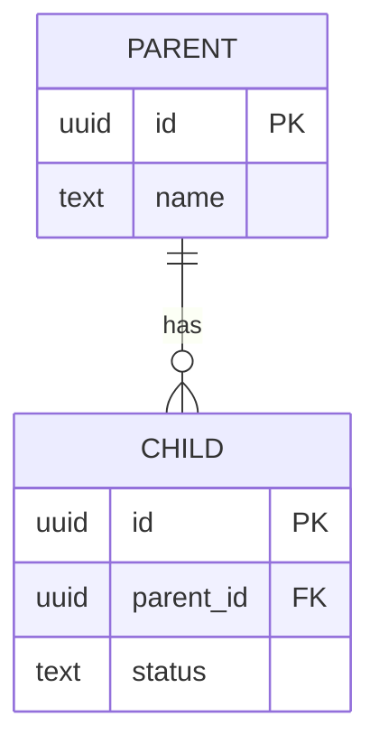
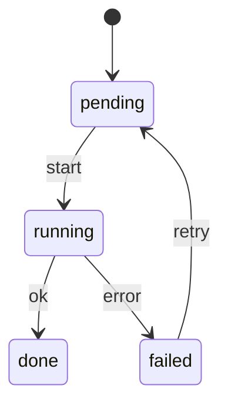
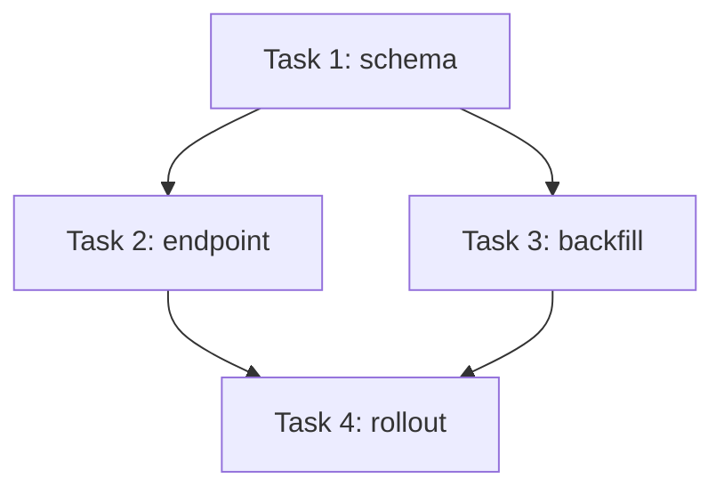
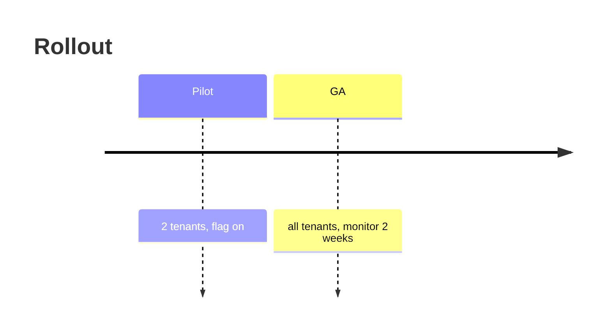

# Visual conventions: diagrams in specs, plans, and MR walkthroughs

The canonical catalog for the visual layer specto adds to its artifacts. Every
template, writer agent, reviewer agent, and lint check that emits or verifies a
diagram cites this file. Define a diagram type here once; reference it everywhere.

## Substrate: mermaid-in-markdown, never MDX

All visuals are **fenced mermaid (or fenced `text`/`diff`) inside the markdown
specto already produces**. This is deliberate:

- It renders in the **GitLab MR view** (GitLab-Flavored Markdown renders mermaid
  natively) where spec and code approval actually happens, **and** in the
  **Markdown Reviewer PWA** (an optional external companion app, not part of this
  plugin), which renders mermaid with a pan/zoom overlay.
- A surface that cannot render mermaid degrades to a labelled code block. The
  content is never lost, only un-rendered.

MDX/JSX block components (`<diagram>`, `<data-model>`, …) are explicitly **not**
used: GitLab cannot render them, so they would cost us the review surface.

## Diagram catalog

Each diagram type has a *required-when* trigger. When the trigger does not fire,
write nothing, or, where a section's structure implies a diagram slot, write the
one-line escape `*Not applicable — <reason>.*` and stop. Do not diagram for its
own sake.

| Purpose | Mermaid form | Required when |
| ------- | ------------ | ------------- |
| Architecture / components | `flowchart` | always for eng-spec §2.1 |
| Runtime flow | `sequenceDiagram` | flow has ≥3 actors OR ≥4 steps |
| Data model | `erDiagram` (or `classDiagram`) | storage model has ≥2 related entities |
| State machine | `stateDiagram-v2` | a status/state enum is added or changed |
| Dependency DAG | `flowchart` from Blocks/BlockedBy | plan has >1 task with an edge |
| Rollout timeline | `timeline` (or `gantt`) | rollout has ≥2 phases |
| File map | fenced ` ```text ` tree | change/plan touches ≥5 files |
| Annotated diff | fenced ` ```diff ` + one-line caption | a single hunk carries the change |

## Minimal forms

Copy and adapt. Keep node ids short; keep the diagram to what the trigger is about,
not the whole system.

**Data model (`erDiagram`):**



**State machine (`stateDiagram-v2`):**



**Dependency DAG (`flowchart`), one node per task, edges from BlockedBy:**



**Rollout timeline:**



(`flowchart` and `sequenceDiagram` forms already live in the eng-spec template §2.1.)

## Quality rules

These are ported from the Planner's `review-visualize` skill, which already solved
the dark-mode and correctness problems.

1. **Validate before writing.** Re-read each mermaid block and confirm every line is
   valid syntax before committing it. A broken fence renders as an error box. Verify it
   programmatically with `scripts/lint/validate-mermaid.sh <file>` — it renders every
   fence through mermaid-cli and reports any syntax error with its line.
2. **Don't fabricate.** Diagram only what the source (spec text, diff, plan edges)
   supports. An invented edge is worse than no diagram.
3. **Keep it small.** One diagram answers one question. When the architecture spans
   multiple callers, split into one structural diagram plus per-caller sequence
   diagrams rather than one omnibus tangle.
4. **Dark-mode palette.** Review surfaces commonly render on a dark theme. **Never**
   use the pastel `classDef` palette mermaid examples ship with (`fill:#ECEFF1`,
   `#E8F5E9`, …): on a dark page they produce light-on-light and become unreadable.
   Either:
   - **No `classDef` at all** (default) — let the theme colour nodes uniformly; or
   - **A dark-mode `classDef` with an explicit `color:`** when you must differentiate
     node kinds:
     ```
     classDef existing fill:#1e293b,stroke:#94a3b8,color:#f4f4f5
     classDef new      fill:#1e3a8a,stroke:#60a5fa,color:#f4f4f5
     classDef changed  fill:#7c2d12,stroke:#fb923c,color:#f4f4f5
     classDef external fill:#3f3f46,stroke:#a1a1aa,color:#e4e4e7
     classDef removed  fill:#7f1d1d,stroke:#f87171,color:#f4f4f5
     ```
     `color:` is required on every line, or mermaid pulls white text onto a pastel fill.
5. **Short node ids.** Prefer `T1`, `svcA` over long quoted strings.

## What's enforced in code

As much of the above as can be checked mechanically is. The rest is inherently
semantic and stays with the writer/reviewer agents.

| Rule | Enforced by | When |
| ---- | ----------- | ---- |
| 1. Valid syntax | `scripts/lint/validate-mermaid.sh` (mermaid-cli render) | agent post-draft + CI; needs a headless Chromium, so kept off the fast lint |
| 1. No half-scaffolded diagram (unfilled `<…>` placeholder, untyped fence) | `checks.d/_shared/check-mermaid-scaffold.sh` | blocking lint (both spec types) |
| 4. `classDef` has explicit `color:` | `checks.d/_shared/check-diagram-palette.sh` | blocking lint |
| 4. No pastel "never use" fill | `checks.d/_shared/check-diagram-palette.sh` (blocklist) | blocking lint |
| 3. Diagram not oversized (line / participant count) | `validate-mermaid.sh` (soft warning, never fails) | agent post-draft + CI |
| 2. Don't fabricate; 3b. split omnibus; 5. short ids; canonical-source | writer + reviewer agents | review (not mechanically decidable) |

The blocking checks are pure bash (no dependencies) and run inside
`product-spec-lint.sh` / `engineering-spec-lint.sh`. `validate-mermaid.sh` is the
richer, browser-backed pass: run it from CI on changed specs, and the spec-writer /
`mr-walkthrough` agents run it after generating diagrams.

## The diagram is canonical

When a diagram and prose describe the same thing, the **diagram is the source of
truth** and the prose is a one-line caption, not a restatement. Prose that duplicates
a diagram is a review finding (it forces the reader to verify two sources agree). This
restates the engineering-spec-guidelines anti-pattern centrally so product specs,
plans, and MR walkthroughs inherit it.
