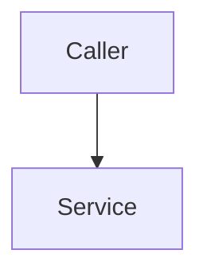
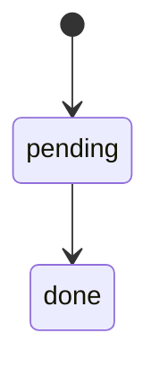

# Spec with readable diagrams

### 2.1. Architecture

A plain diagram with no classDef (theme colours it) passes.

```mermaid
flowchart TD
    A[Caller] --> B[Service]
```

### 2.5. Failure modes

A classDef that declares color: explicitly passes.

```mermaid
stateDiagram-v2
    [*] --> pending
    pending --> done
    classDef new fill:#1e3a8a,stroke:#60a5fa,color:#f4f4f5
```
