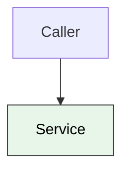

# Diagram with a pastel fill that declares color

The no-color rule would pass this (color: is present), but the pastel fill is still
light-on-light on the dark reviewer, so the pastel blocklist must catch it.

