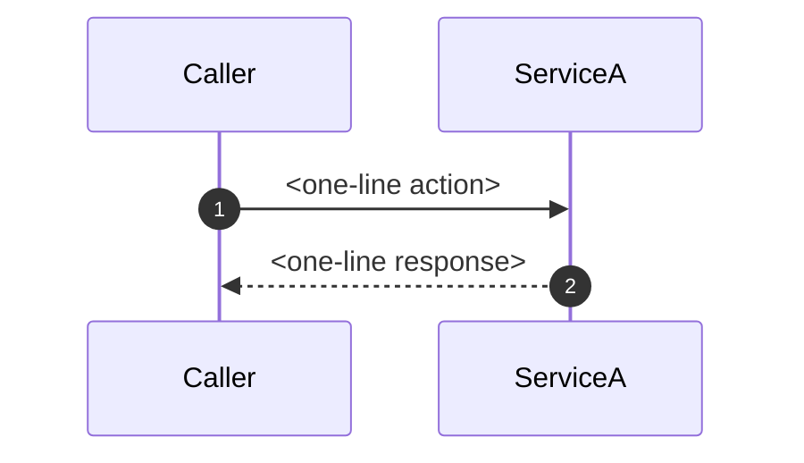

# Spec with an unfilled diagram scaffold

### 2.1. Architecture

```mermaid
sequenceDiagram
    autonumber
    participant Caller
    participant ServiceA
    Caller->>ServiceA: <one-line action>
    ServiceA-->>Caller: <one-line response>
```
