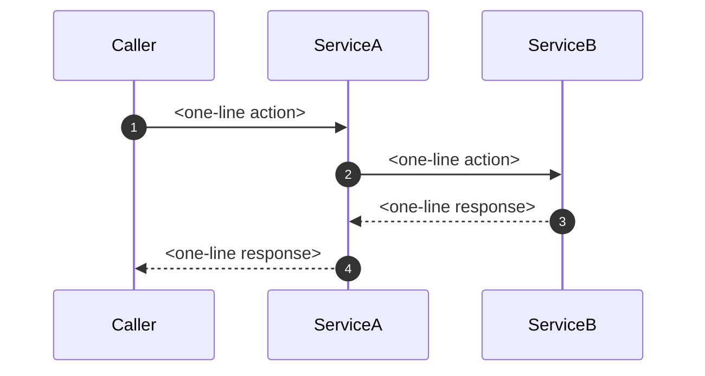

| | |
|---|---|
| **Product spec link** | [product-spec.md](product-spec.md) |
| **Epic link** | [<TICKET>](https://<tracker-site>/browse/<TICKET>) |
| **Change classification** | <Standard \| Non-standard (Q1 / Q2 / Q3)>; populated from the linked epic by `new-spec` when a compliance profile is configured — delete this row otherwise |
| **Development Stage** | <Discovery \| Validation \| Production>; from the linked epic |
| **Epic Type / Delivery cycle** | <Epic Type, e.g. Strategy> / <YYYY QN, e.g. 2026 Q2>; from the linked epic |
| **Version / scope** | V1 |
| **AI feature** | <YES, link to AI test plan / NO> |

## Engineering Stakeholders

> The product specification (and stakeholder approval thereof) is a prerequisite for engineering review. See [product-spec.md](product-spec.md).

| Representing / SME  | Representative              | ✓ / ✗ | Scope |
| ------------------- | --------------------------- | ----- | ----- |
| Engineering manager | @<em-handle>                |       |       |
| Engineering team    | @<eng-handle-1>             |       |       |
| Platform team       | @<platform-handle>          |       | API best practices and standards |
| Security reviewer *(if your compliance profile requires one)* | @<security-handle-or-blank> |       | Test plan |

---

# Engineering Specifications

> **Applicability matrix.** Sections marked *(opt-in)* are required only when the spec's condition flags say so — intrinsic flags (AI feature, schema changes, new infra, Development Stage) plus compliance-profile flags when a profile is configured. See `references/engineering-spec-guidelines.md` § Applicability matrix. When out of scope, write `*Not applicable — <flag> = <value>*` in one line and move on.

## 1. Non-functional requirements

### 1.1. Latency, throughput, scale

*<one sentence per endpoint or pipeline stage with concrete targets>*

### 1.2. Availability and SLOs *(opt-in: required when Development Stage = Production)*

*<one line: SLO target + link to SLA page; or `*Not applicable — pre-production stage.*`>*

### 1.3. Cost envelope *(opt-in: required when new infra is introduced or the compliance flag `availability` is set)*

*<one sentence: compute + storage + embedding budget; or `*Not applicable — no new infra.*`>*

## 2. Technical approach

### 2.1. Architecture

*Structural diagram (mermaid `flowchart` or Figma link) showing the components and how they connect. One sentence of caption.*

*When the change involves ≥3 actors (services, queues, callers) OR ≥4 steps, also include a mermaid `sequenceDiagram` showing the interaction flow. Prose summarises the diagram; the diagram is canonical. Skip the sequence diagram only when the flow is genuinely a single call — state `*Single-call flow; no sequence diagram needed.*` so reviewers know it was considered.*

### 2.2. Algorithm details

*<formal description if applicable. Link to prototyping MR / paper.>*

### 2.3. Storage model

*<schema changes as a table; indexes; retention. State `*No schema changes.*` if none.>*

*When the storage model has ≥2 related entities, add a mermaid `erDiagram` showing the relations (see `references/visual-conventions.md`). The diagram is canonical; the table captions it. Skip it for a single standalone table.*

### 2.4. Compute placement

*<one sentence: sync vs async, where embeddings live, batching.>*

### 2.5. Failure modes and degradation

*<one sentence: what degrades first, and what page-receiving on-call does.>*

*When this change adds or changes a status/state enum, add a mermaid `stateDiagram-v2` for the transitions (see `references/visual-conventions.md`) instead of describing them in prose.*

### 2.6. Endpoint contracts *(opt-in: required when the spec adds or changes endpoints)*

*One sub-section per new endpoint. Mirror existing endpoint shapes in the codebase wherever a parallel exists. Add an `Existing endpoint changes` subsection when the spec modifies endpoints that already exist.*

#### *<Endpoint name>*

`<METHOD> /<path>`

- Path params: *(table)*
- Query params: *(table with default + range)*
- Request body: *(table)*
- Response 200: *(table with a prior-art column where an existing endpoint is mirrored)*
- Error responses: *(table)*
- Caps: *<top N per source, max rows>*

#### Existing endpoint changes

*Required when the spec modifies endpoints that already exist (new field, new request param, changed semantics). One bullet per endpoint stating surface + what changes + why.*

- `<METHOD> /<path>` — *<what changes; semantic implications>*

## 3. Test plan

### 3.1. Unit and integration coverage

*<one sentence: what's covered; link to test files once written.>*

### 3.2. AI test plan *(opt-in: required when AI feature = Yes)*

*<eval set, accuracy threshold, regression detection. Or: `*Not an AI feature.*`>*

### 3.3. Load testing *(opt-in: required when AI feature = Yes or the compliance flag `availability` is set)*

*<one sentence: scenario, tool, pass criteria. Or: `*Not applicable.*`>*

### 3.4. Canary and rollout plan

*<one sentence: feature flag, canary percentage, success criteria, rollback trigger.>*

## 4. Rollback plan

### 4.1. Failure indicators

*<one line: metric / alert / dashboard names.>*

### 4.2. Rollback procedure

*<one sentence: steps, estimated time, who runs it.>*

### 4.3. Data migration reversibility *(opt-in: required when §2.3 has schema changes)*

*<reversible? if not, one-line forward-fix plan. Or: `*Not applicable — no schema changes.*`>*

## 5. Other affected systems *(opt-in: required when the change touches systems outside the spec's primary one)*

*One sub-section per affected system (pipelines, exports, downstream consumers). Use the read-only-observer framing: state explicitly where the spec's primary system writes back vs reads only, so ownership stays clear. One-liner `*Not applicable — change is contained to the primary system.*` when nothing downstream is affected.*

### 5.1. *<Affected system>*

| Step / surface | Action | Why |
| -------------- | ------ | --- |
| *<step name or file path>* | *<change or "no change">* | *<rationale>* |

## 6. Design decisions for engineering approval

### 6.1. *<Decision title>*

- **Proposed (V1):** *<one line>*
- **Rationale:** *<2-3 lines>*
- **Alternatives considered (optional):** *(useful when the choice was non-obvious — drop the row entirely if the trade-off is uncontroversial)*

  | Option | Pros | Cons | Why rejected |
  | ------ | ---- | ---- | ------------ |
  | *<Alt A>* | *<one line>* | *<one line>* | *<one line>* |

- **Open question for engineering:** *<yes/no, what specifically is being asked>*
- **Decision (V1):** *<filled after sign-off, with approver name>*
